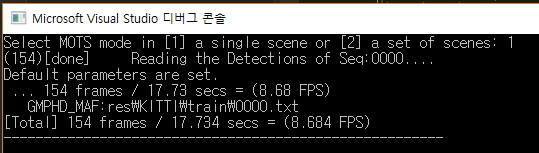

# I. Introduction
## Online Multi-Object Tracking and Segmentation <br> with GMPHD Filter and Mask-based Affinity Fusion (GMPHD_MAF)
This repository includes an implementation of the GMPHD_MAF tracker in C/C++ with a demo code and supplementary materials.

## Progress

+ **_[2021.06.00] Writing this README.md now..._** <br>
+ [2021.06.17] First full upload of a C/C++ implementation in VS2017 project (with VC15), **_v0.2.0_**. <br>
+ [2021.06.11] Full manuscript upload in **_arXiv_**

## Paper 

+ The paper is available in two versions:
[[BMTT2020 website](https://motchallenge.net/workshops/bmtt2020/index.html)]
and [[arxiv](https://arxiv.org/abs/2009.00100)]. <br>
+ The arXiv preprint is an extension of the BMTT worshop paper.

# II. User guide

## Development Environment
+ Windows 10  (64 bit) <br>
+ Visual Studio 2017  (64 bit)

### Programming languages
+ Visual C/C++ (VC15)

### Libaries
[OpenCV 3.4.1](https://www.opencv.org/opencv-3-4-1.html) and 
[boost 1.74.0 (Windows Binaries)](https://sourceforge.net/projects/boost/files/boost-binaries/1.74.0/) 
were used to implement the GMPHD_MAF tracker.
+ Download [OpenCV Win Pack](https://sourceforge.net/projects/opencvlibrary/files/opencv-win/3.4.1/opencv-3.4.1-vc14_vc15.exe/download) and [boost_1_74_0-msvc-14.1-64.exe](https://sourceforge.net/projects/boost/files/boost-binaries/1.74.0/boost_1_74_0-msvc-14.1-64.exe/download) to run our tracker in Visual Studio 2017 (64 bit).

## Project source
### File tree
```
PROJECT_HOME
├── GMPHD_MAF.sln  <-- **solution file for the project**
└── GMPHD_MAF      
    ├── demo_GMPHD_MAF.cpp                            <-- **the main function** including demos.
    ├── OnlineTracker.h, OnlineTracker.cpp            <-- the parent class of GMPHD_MAF
    ├── GMPHD_MAF.h, GMPHD_MAF.cpp                    <-- *a class implementation of the GMPHD_MAF tracker* inherited from OnlineTracker class
    ├── kcftracker.hpp&cpp, VOT.h, ffttols.hpp, fhog.hpp&cpp, labdata.hpp, recttols.hpp <-- a C++ code set of KCF [2] implementaion
    ├── utils.hpp                                     <-- a header file including essential containers and preprocessors for GMPHD_MAF
    ├── io_mots.hpp&cpp, mask_api.h&cpp               <-- read/write functions for MOTS data format (e.g., run-length encoding)
    ├── drawing.hpp, drawing.cpp                      <-- drawing functions for MOTS results visualization
    ├── hungarian.h, hungarian.cpp                    <-- a class implementation of the Hungarian Algorithm 
    ├── pch.h                                         <-- precompiled header including essential header files
    ├── GMPHD_MAF.vcxproj, GMPHD_MAF.vcxproj.filters  <-- VS project file, VS project filter file
    ├── params                                        <-- text files containing scene parameters
    |   └── KITTI_test.txt, KITTI_train.txt, MOTS20_test.txt, MOTS20_train.txt
    ├── seq                                           <-- text files containing dataset paths and sequences' names
    |   └── KITTI_test.txt, KITTI_train.txt, MOTS20_test.txt, MOTS20_train.txt
    ├── img                                           <-- MOTS results are saved in {seqname}/*.jpg
    |   ├── KITTI
    |   |   └── test, train                           
    |   └── MOTS20
    |       └── test, train 
    └── res                                           <-- MOTS results are saved in {seqname}.txt
        ├── KITTI
        |   └── test, train 
        └── MOTS20
            └── test, train 
```

C++ implementation of the Hungarian Algorithm : 
`
hungarian.h, hungarian.cpp 
`
, refering to [#mcximing/hungarian-algorithm-cpp](https://github.com/mcximing/hungarian-algorithm-cpp) <br> 

C++ implementaion of KCF [2] :
`
kcftracker.hpp&cpp, VOT.h, ffttols.hpp, fhog.hpp&cpp, labdata.hpp, recttols.hpp
`
, refering to [#joaofaro/KCFcpp](https://github.com/joaofaro/KCFcpp) <br> 

## How to run
1. Open the solution file **GMPHD_MAF.sln**.
2. Link and include **OpenCV3.4.1** and **boost1.74.0** libraries to the project w/ VC15_x64.
3. Press Ctrl+F5 in **Release mode (x64)**
+ We provide two MOTS processing modes. One is "1: a single scene" and the other is "2: a set of scenes".

## Input
#### 1. Images and public instance segmentation results
+ Download the image seqeunces in [KITTI-MOTS](https://www.vision.rwth-aachen.de/page/mots) and [MOTS20](https://motchallenge.net/data/MOTS/) <br>
  and MaskRCNN [3] based segmentation results, in txt format, named Tracking Only Challenge Detections in [here](https://www.vision.rwth-aachen.de/page/mots)

* Locate the segmentation results in each corresponding dataset location. <br>
  * For instance, copy the results to `F:\KITTI\tracking\train\det_02_maskrcnn`, `F:\KITTI\tracking\test\det_02_maskrcnn` , `F:\MOTS\MOTS20\test\maskrcnn`, and `F:\MOTS\MOTS20\train\maskrcnn`. 
  * Keep the folder names `det_02_maskrcnn` in KITTI-MOTS and `maskrcnn` in MOTS20, or modify the function `ReadDatasetInfo()` in [io_mots.cpp](GMPHD_MAF/io_mots.cpp)
  
#### 2. Sequence list files of the image sequences
> Users should specify the dataset path and sequences' names in the sequence list file.
```
e.g., GMPHD_MAF\seq\MOTS20_train.txt
F:\MOTS\MOTS20\train\
MOTS20-02
MOTS20-05
MOTS20-09
MOTS20-11
```

#### 3. Parameter files
```
e.g., GMPHD_MAF\params\MOTS20_train.txt
```
#### 4. Please check DB_TYPE, mode:"train" or "test", and the input files' locations in ([demo_GMPHD_MAF.cpp](GMPHD_MAF/demo_GMPHD_MAF.cpp))
```
// demo_GMPHD_MAF.cpp
...
const int DB_TYPE = DB_TYPE_MOTS20;		// DB_TYPE_KITTI_MOTS, DB_TYPE_MOTS20
const string MODE = "train";			// 'train', 'test'
const string DETECTOR = "maskrcnn";		// 'maskrcnn'
const string TRACKER = "GMPHD_MAF";		// Mask-Based Affinity Fusion
const string SEQ_TXT = "seq/" + sym::DB_NAMES[DB_TYPE] + "_" + MODE +".txt" ;
const string PARAMS_TXT = "params/"+ sym::DB_NAMES[DB_TYPE] + "_" + MODE + ".txt";
...
```
## Output

### Results files
  + MOTS results files are saved at `GMPHD_MAF/res`
### Visualization options in [utils.hpp](GMPHD_MAF/utils.hpp)
```
#define VISUALIZATION_MAIN_ON 0
#define SKIP_FRAME_BY_FRAME 0
```
> VISUALIZATION_MAIN_ON: 0(off), 1(on)
  + You can see the visualization windows of detection and tracking.
    * At initial frame, press any key to start tracking process.

> SKIP_FRAME_BY_FRAME: 0(off), 1(on)
  + You can see the results, frame-by-frame. (by pressing any key). 

### Examples in KITTI object tracking test 0018 sequence.


`▶ Public segmentation results by MaskRCNN [2]`


`▶ MOTS results by GMPHD_MAF (Ours)`

### Console window


`▶ Console window exampled when user select a single scene mode`

## Experimental Results (available at the benchmark websites)

We participated "tracking only" track in 5th BMTT MOTChallenge Workshop: Multi-Object Tracking and Segmentation in conjunction with CVPR 2020.

The results are available in 
CVPR 2020 MOTSChallenge [[link](https://motchallenge.net/results/CVPR_2020_MOTS_Challenge/)], 
MOTS20 [[link](https://motchallenge.net/results/MOTS/)],

KITTI-MOTS w/ sMOTSA measure [[link](http://www.cvlibs.net/datasets/kitti/eval_mots.php)] and w/ HOTA measure [[link](http://www.cvlibs.net/datasets/kitti/eval_mots.php)].

# III. References

[1] Ba-Ngu Vo and Wing-Kin Ma, "The Gaussian Mixture Probability Hypothesis Density Filter," _IEEE Trans. Signal Process._, vol. 54, no. 11, pp. 4091–4104, Oct. 2006. [[paper]](https://ieeexplore.ieee.org/document/1710358)

[2] João F. Henriques, Rui Caseiro, Pedro Martins, and Jorge Batista "High-Speed Tracking with Kernelized Correlation Filters" _IEEE Trans. Pattern Anal. Mach. Intell._, vol. 37, no. 3, pp. 583–596, Mar. 2015.
[[paper]](https://ieeexplore.ieee.org/abstract/document/6870486)
[[arxiv]](https://arxiv.org/abs/1404.7584)

[3] Kaiming He, Georgia Gkioxari, Piotr Dollar, and Ross Girshick "Mask R-CNN" _in Proc. IEEE Int. Conf. Comput. Vis. (ICCV)_, Oct. 2017, pp. 2961–2969. 
[[paper]](https://openaccess.thecvf.com/content_ICCV_2017/papers/He_Mask_R-CNN_ICCV_2017_paper.pdf)
[[arxiv]](https://arxiv.org/abs/1703.06870)

## Citation [[arxiv]](https://arxiv.org/abs/1907.13347)

```
\bibitem{gmphdmaf}
  Y. Song, Y.-C. Yoon, K. Yoon, M. Jeon, S.-W. Lee, and W. Pedrycz, 
  ``Online Multi-Object Tracking and Segmentation with GMPHD Filter and Mask-based Affinity Fusion,'' 2021, 
  [{O}nline]. Available: ar{X}iv:2009.00100.
```

## IV. [License](https://github.com/SonginCV/GMPHD_MAF/blob/master/LICENSE)
BSD 2-Clause "Simplified" License

